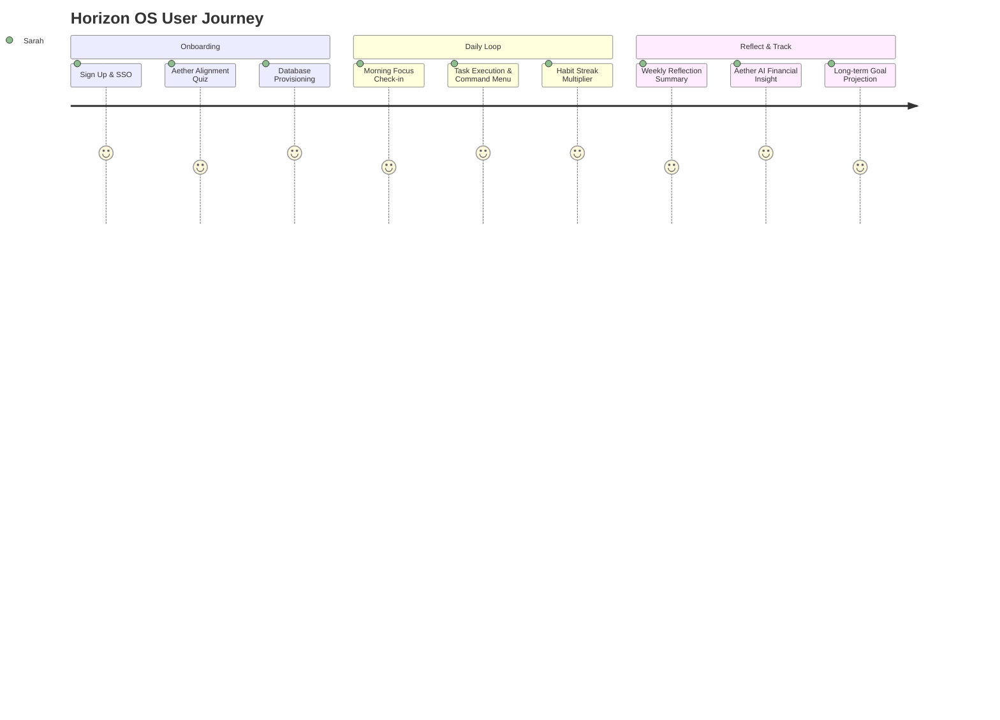
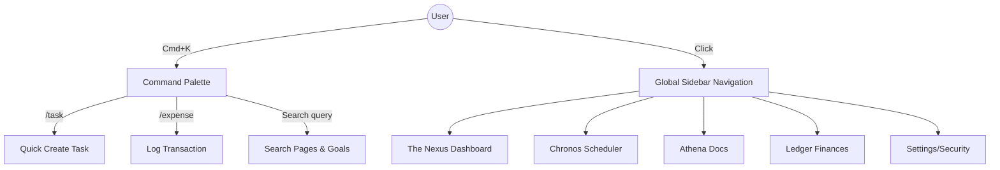
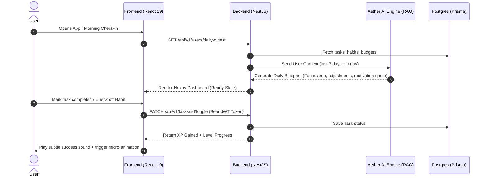
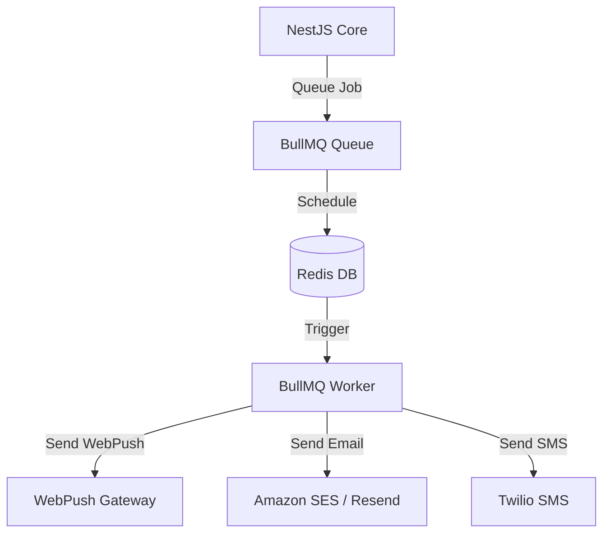

# Horizon OS: AI-Powered Life Planning Platform
### Product Design, Software Architecture, and Security Blueprint

---

## 1. Product Vision

**Horizon OS** is the "Operating System for Human Potential." 

Unlike traditional, dry task managers that act as checklists of chores, Horizon OS is a **proactive cognitive companion** that merges goal-setting, knowledge management, habit loops, and financial tracking into a unified, minimal workspace. Inspired by the sleek aesthetics of **Linear** (high density, command-menu driven), **Notion** (modular blocks), and **Apple** (delightful micro-interactions), Horizon OS shifts the paradigm from *passive tracking* to *active pathfinding*.

```
   [ Horizon OS Core Ecosystem ]
   +---------------------------------------------------+
   |                    THE NEXUS                      |
   |           (Central Cognitive Dashboard)           |
   +---------------------------------------------------+
       |                 |               |         |
+------------+    +------------+    +--------+  +------------+
|  KAIROS    |    |   ATHENA   |    | LEDGER |  |  ODYSSEY   |
| (Time/Task)|    |(Knowledge) |    |(Wealth)|  |(Journeys)  |
+------------+    +------------+    +--------+  +------------+
       \                 |               |         /
   +---------------------------------------------------+
   |                     AETHER AI                     |
   |   (Synthesizer, Coach, Planner, RAG Companion)   |
   +---------------------------------------------------+
```

---

## 2. User Personas

### Persona A: "The Overwhelmed Maximizer" (Sarah, 29)
* **Role:** Senior Product Manager in Tech.
* **Goals:** Wants to balance corporate OKRs, gym schedule, habit tracking, personal projects, and travel planning without burning out.
* **Frustrations:** Uses 5 different apps (Todoist, Notion, Excel, Google Calendar, Apple Notes). Information is fragmented. She feels anxious rather than motivated.
* **Value Metric for Horizon:** Single source of truth; daily cognitive load reduction.

### Persona B: "The Mindful Builder" (Alex, 34)
* **Role:** Freelance UX Specialist.
* **Goals:** Long-term wealth planning, reading more books, maintaining a consistent gym schedule, and learning French.
* **Frustrations:** Struggles with visual clutter. Traditional apps make goals feel like "chores" and lack long-term visibility.
* **Value Metric for Horizon:** Aesthetic satisfaction; seeing daily habits map directly into "Monthly/Yearly Goals".

---

## 3. User Journey Map



1. **Discovery & Onboarding:** The user signs up (via Google OAuth/Magic Link). The **Aether AI Alignment Quiz** asks about their current lifetime goals, habits, and obstacles, configuring a customized workspace profile immediately.
2. **First Value Moment (AHA!):** Within 3 minutes, the user sees a single, gorgeous dashboard showing their tasks, a curated focus area, and an AI-generated suggestion: *"You scheduled 3 high-cognitive tasks today. Let's push workout to 6 PM."*
3. **Daily Habit Loop:** The user accesses Horizon via a desktop app/Vite PWA, interacting through `Cmd + K` commands. XP triggers on habit streak completions.
4. **Weekly Reflection & Review:** AI summarizes achievements, visualizes financial transactions imported via bank sync/receipt scanning, and prompts: *"You completed 90% of your career tasks, but family habits were skipped. Let's adjust."*

---

## 4. Feature Prioritization (MoSCoW Matrix)

| Priority | Features |
| :--- | :--- |
| **Must Have** | JWT/Refresh Token Auth, The Nexus (Dashboard), Chronos (Daily/Weekly/Monthly tasks), Athena (Notes/Blocks), Ledger (Income/Expenses), RLS Postgres Policies |
| **Should Have** | Aether AI Daily Synthesizer, Habit Streak engine, Command Palette (`Cmd + K`), WebPush Notification Engine, Drag-and-Drop prioritization |
| **Could Have** | Plaid API bank integration, Workout Generator, Travel planner maps, Gamified Level/XP progression system |
| **Won't Have (v1)**| Collaborative multi-user team spaces, Custom theme editor (locked to Light/Dark minimalist presets), Manual DB backup export tools |

---

## 5. Complete Sitemap

```
Horizon OS
├── Auth (Login, Register, Forgot Password, MFA Setup)
├── Nexus Dashboard (Universal Hub, Daily Focus, AI Coach Command)
├── Chronos (Time Engine)
│   ├── Inbox (Unsorted thoughts/tasks)
│   ├── Daily Schedule (Time-blocked board)
│   └── Goal Horizon (Weekly Plans, Monthly Milestones, Yearly Themes, Lifetime Vision)
├── Athena (Knowledge Engine)
│   ├── Notebooks (Markdown pages, block editing)
│   ├── Bookshelf (Reading progress tracker, notes extraction)
│   └── Academics (Course/learning tracking, exam countdowns)
├── Ledger (Wealth Engine)
│   ├── Transactions (Manual/CSV/Sync ledger)
│   └── Salary Planner (Allocation budgets, future projection charts)
├── Odyssey (Life Planner)
│   ├── Project boards (Subtasks, Gantt/Timeline view)
│   ├── Travel Hub (Itineraries, packing lists, map nodes)
│   └── Health Tracker (Workouts, hydration habits)
└── Settings (Profile, Integrations, 2FA, Billing)
```

---

## 6. Navigation Flow

Horizon OS uses an **immersive double-dock layout**:
1. **Vertical Sidebar (Collapsible):** Housekeeping links (Dashboard, Chronos, Athena, Ledger, Odyssey, Settings).
2. **Global Command Bar (`Cmd+K` or `Ctrl+K`):** Universal entry point. A user can search notes, add expenses, create tasks, or trigger AI queries from anywhere.



---

## 7. User Flow: The Daily Planning & Alignment Flow



---

## 8. AI Features (Aether AI Engine)

Horizon OS does not just slap a standard ChatGPT prompt into a sidebar. The AI engine is integrated at the system level.

### Feature 1: The Daily Synthesizer
* **Action:** Triggered every morning at 5:00 AM via a cron job.
* **Logic:** Aggregates user's tasks, sleep data (if integrated), budget limits, and habits.
* **Output:** Creates a 3-sentence summary: *"Your energy budget is high. Focus on your Career Goal (Project Apollo) before 2 PM. Avoid spending today to stay within your weekly limit."*

### Feature 2: Aether RAG Companion
* **Action:** Integrated into Athena notes.
* **Logic:** Vectorizes user notes, books read, and thoughts using `pgvector` inside PostgreSQL.
* **Output:** In the editor, typing `++` prompts the AI to pull connections: *"Based on the books you read last month, this idea aligns with atomic habit systems."*

---

## 9. Notification System

To keep users motivated without causing notification fatigue, Horizon OS uses the **Three-Tier Smart Alert System**:

```
+------------------+     +-------------------+     +------------------+
|   Push / SMS     |     |   Daily Digest    |     |   System Log     |
|   (Urgent ONLY)  |     |   (Email/Web)     |     |   (Passive)      |
|  * Due tasks     |     |  * Daily plan     |     |  * Achievement   |
|  * Budget alert  |     |  * Streak alerts  |     |  * Level Ups     |
+------------------+     +-------------------+     +------------------+
```

* **Urgent (Push/SMS):** Triggered strictly for critical events (e.g. Budget overruns, immediate reminders).
* **Medium (Daily Digest):** Delivered at 7:30 AM via email or push. Contains the Aether Daily Synthesizer output.
* **Low (Passive Log):** Displayed strictly in-app via a notifications bell. Used for XP achievements, streaks, and system changes.

---

## 10. Gamification & Motivation (Duolingo-for-Life)

To avoid feeling like a boring task manager, the app employs a non-childish, executive gamification system:

* **The Streak Multiplier (Momentum):** Completing tasks and keeping habits builds your *Momentum Multiplier* (up to `3x`). A higher multiplier increases the XP gained per task. 
* **Experience Points (XP) & Levels:** Completing tasks yields XP. Levels are displayed on the user's profile with clean geometric badges (inspired by GitHub's contribution grid).
* **Weekly Focus Goals:** Users choose one major "Focus Area" each week (e.g., 🔴 Health, 🔵 Wealth, 🟢 Learning). Activities in this focus area grant `2x` XP.

---

## 11. Achievement System

Achievements are unlocked in the background and presented as minimal, gorgeous cards that the user can pin to their Nexus Dashboard.

| Achievement Name | Target Event | XP Reward | Visual Asset |
| :--- | :--- | :--- | :--- |
| **Financial Fortress** | Budget kept 4 weeks consecutively | +500 XP | Emerald Safe Badge |
| **Monk Mode** | 7 days streak on all primary habits | +1000 XP | Golden Lotus Badge |
| **Horizon Chaser** | First Yearly Goal successfully completed | +2000 XP | Prism Compass Badge |
| **Polymath** | 5 Books logged as completed | +750 XP | Leather Scroll Badge |

---

## 12. Reminder Engine (NestJS Architecture)

The reminder engine is designed to handle high concurrency with zero lag using a Redis-backed queue system.



* **Storage:** Scheduled reminders are stored in the PostgreSQL database.
* **Execution:** On startup or change, the scheduling service pushes future events into **BullMQ** (Redis).
* **Reliability:** If a node crashes, Redis maintains the queue state. Workers recover failed notifications automatically.

---

## 13. Monetization Ideas

Horizon OS utilizes the **Stripe-powered SaaS Pricing Matrix**:

### 1. Free Tier (The Core Engine)
* **Includes:** Daily tasks, up to 3 active habits, manual expense tracking, local notes.
* **Limitations:** No AI features, local database storage backups only, no integrations.

### 2. Pro Tier ($8/month or $72/year)
* **Includes:** Unlimited habits/tasks/projects, full Aether AI Synthesizer access, bank-account sync, vector-backed search over notes, full notifications dashboard.

### 3. Lifetime Visionary ($250 one-time)
* **Includes:** Lifetime Pro access, exclusive minimalist UI themes, priority AI responses, name listed in the founding members page.

---

## 14. Future Roadmap

```
Phase 1: Core System (Months 1-3)
├── Setup NestJS/Vite/Prisma boilerplate
├── Fully configure JWT/Auth/2FA module
└── Complete responsive React pages and index CSS
Phase 2: Cognitive AI Engine (Months 4-6)
├── Deploy pgvector database schemas
├── Integrate OpenAI/Anthropic SDKs into RAG companion
└── Develop Habit and Streak tracking algorithm
Phase 3: Integrations & Mobile Native (Months 7-9)
├── Build iOS/Android Capacitor wrapper
├── Plaid API and Google Calendar synchronization
└── Open API Access for custom webhooks
```

---

## 15. Security Architecture (NestJS + Prisma)

1. **Authentication Flow:** 
   - HTTPOnly, Secure, SameSite cookies for refresh tokens.
   - Short-lived Access Tokens (JWT) carried in memory.
2. **Two-Factor Authentication (2FA):** 
   - Time-based One-time Passwords (TOTP) supported via Google Authenticator.
3. **Data Protection:** 
   - Sensitive financial accounts, sync credentials, or private user IDs are encrypted at the app layer before being written to PostgreSQL using AES-256-GCM.
